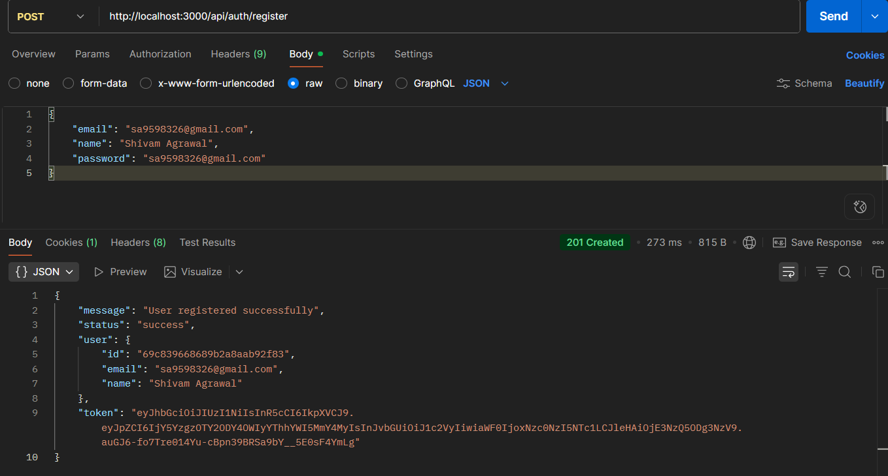
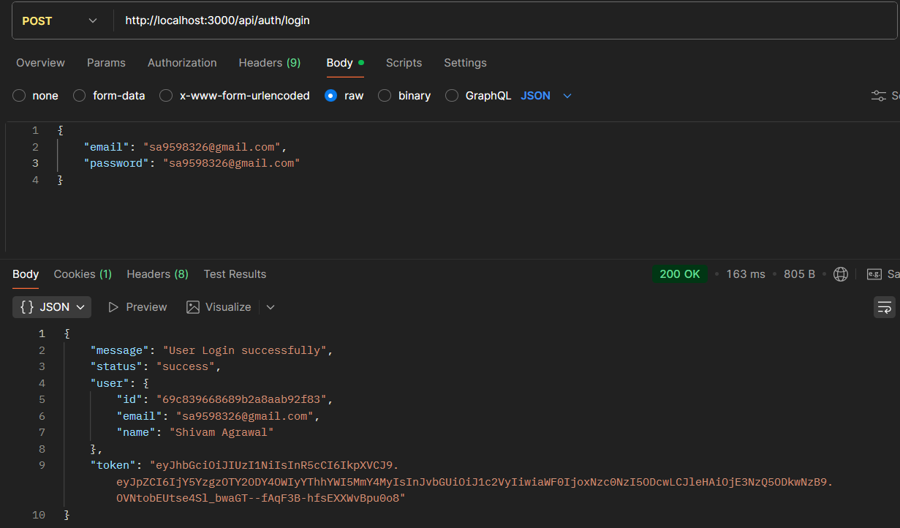
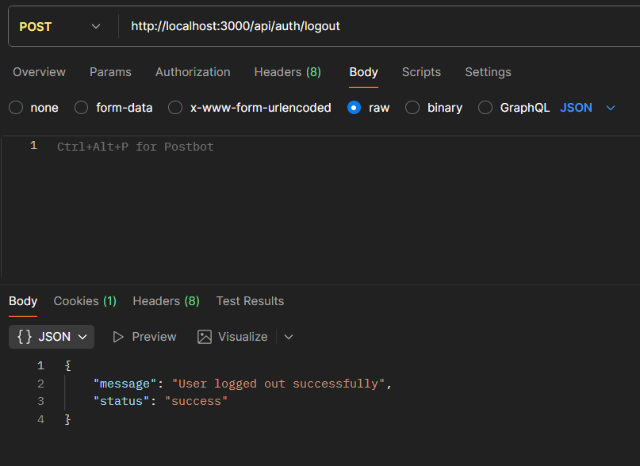
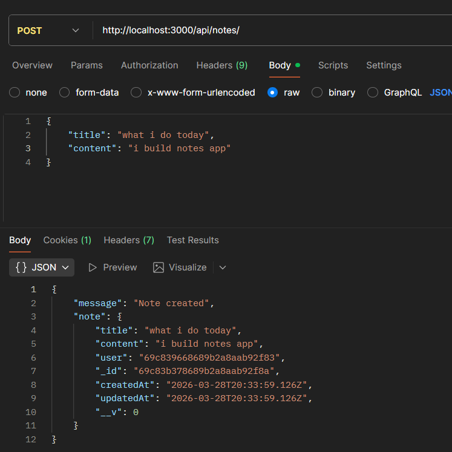
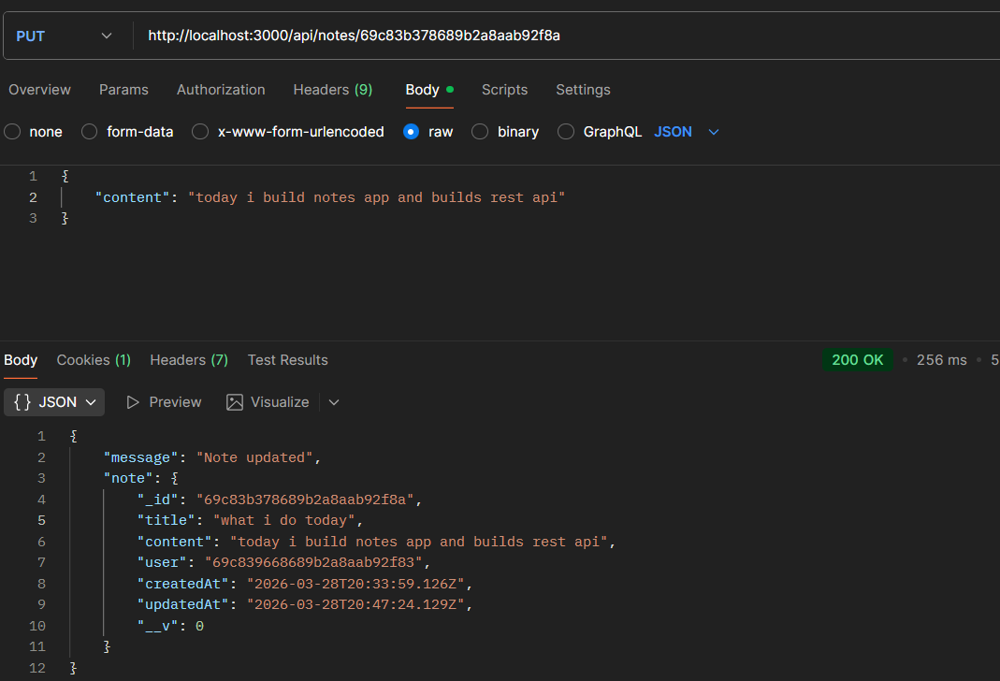
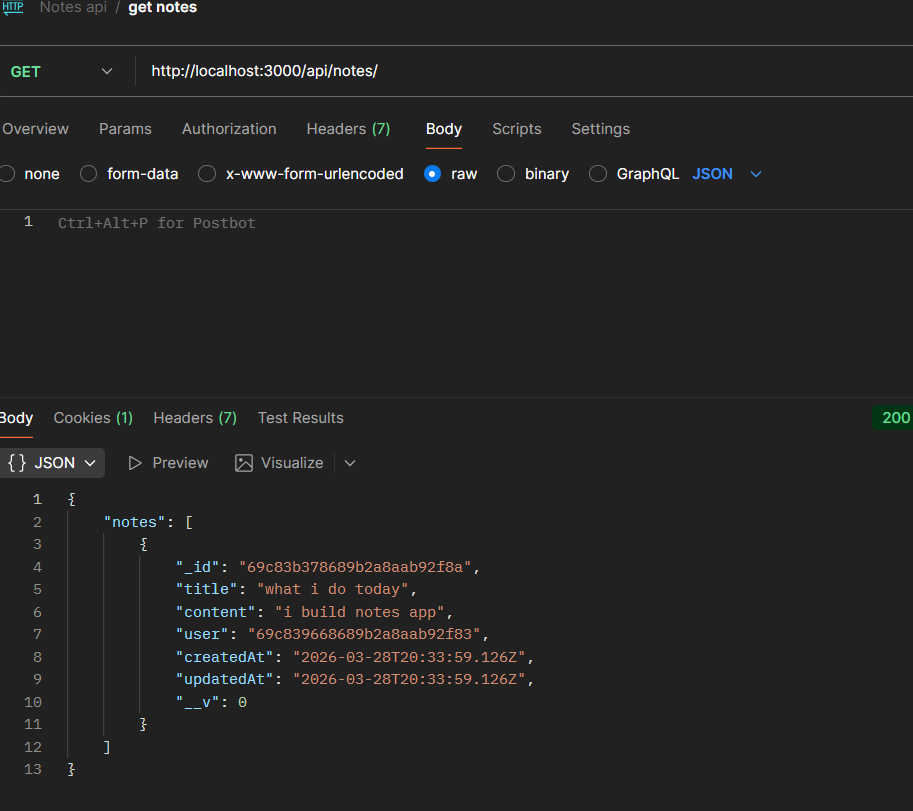
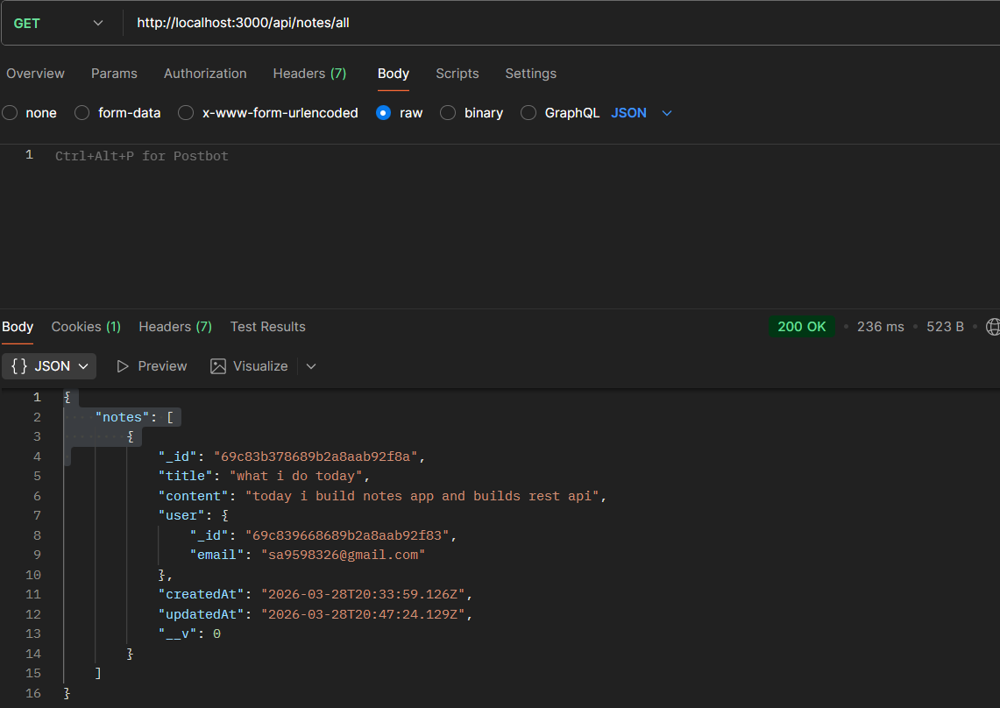

# 📝 Notes App Backend
 
A secure and scalable Notes API with authentication, role-based access, and CRUD operations built using Node.js, Express, and MongoDB.
💡 Built as part of internship assignment showcasing secure backend architecture and real-world API design.
 
---
 
## 🚀 Features
 
- 🔐 JWT Authentication (Login/Register)
- 👤 Role-Based Access (User & Admin)
- 📝 Notes CRUD Operations
- 🚫 Secure Logout using Token Blacklisting
- ⚡ Optimized queries using indexing
- 🛡️ Protected routes using middleware
 
---
 
## 🛠️ Tech Stack
 
- Node.js
- Express.js
- MongoDB (Mongoose)
- JWT
- bcrypt
- Cookie-parser
 
---
 
## 📁 Project Structure
 
```
backend/
├── src/
│   ├── controllers/
│   ├── middleware/
│   ├── models/
│   ├── routes/
│   └── app.js
├── server.js
├── package.json
```
 
---
 
## ⚙️ Setup Instructions
 
**1. Clone the repository**
```bash
git clone https://github.com/shiviislive/notes-app.git
cd notes-app
```
 
**2. Install dependencies**
```bash
npm install
```
 
**3. Create `.env` file**
```env
PORT=3000
MONGO_URI=your_mongodb_url
JWT_SECRET=your_secret
```
 
**4. Run the server**
```bash
npm run dev
```
 
---
 
## 🔑 API Endpoints
 
### Auth
 
| Method | Endpoint              | Description        | Access |
|--------|-----------------------|--------------------|--------|
| POST   | `/api/auth/register`  | Register new user  | Public |
| POST   | `/api/auth/login`     | Login & get token  | Public |
| POST   | `/api/auth/logout`    | Logout (blacklist) | Auth   |
 
### Notes
 
| Method | Endpoint          | Description       | Access       |
|--------|-------------------|-------------------|--------------|
| POST   | `/api/notes`      | Create a note     | User + Admin |
| GET    | `/api/notes`      | Get own notes     | User + Admin |
| PUT    | `/api/notes/:id`  | Update a note     | User + Admin |
| DELETE | `/api/notes/:id`  | Delete a note     | User + Admin |
 
### Admin
 
| Method | Endpoint         | Description   | Access     |
|--------|------------------|---------------|------------|
| GET    | `/api/notes/all` | Get all notes | Admin only |
 
---
 
## 📬 API Collection

Download Postman Collection:  
[notes-api.postman_collection.json](./notes-api.postman_collection.json)

## 🔐 Authentication & Authorization
 
- JWT-based authentication
- Token stored in cookies or headers
- Role-based access control:
  - **User** → manages own notes
  - **Admin** → can view all notes
 
---
 
## 📸 API Testing
 
### Register

 
### Login


### Logout

 
### Create Note


### Update Note


### Get Notes


### Admin Fetching all Notes

 
---
 
## 🧠 Key Learnings
 
- Implemented secure authentication using JWT
- Learned role-based authorization
- Debugged middleware and async issues
- Designed RESTful APIs with proper structure
 
---
 
## 🚀 Future Improvements
 
- Add frontend (React)
- AI-based note summarization
- Pagination & search
- Deployment
 
---
 
## 👨‍💻 Author
 
**Shivam Agrawal**  
IIIT Bhopal