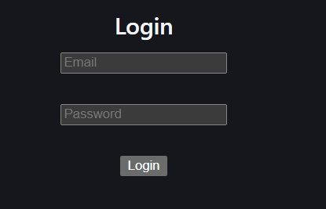
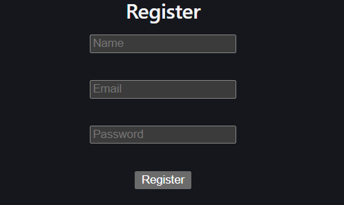
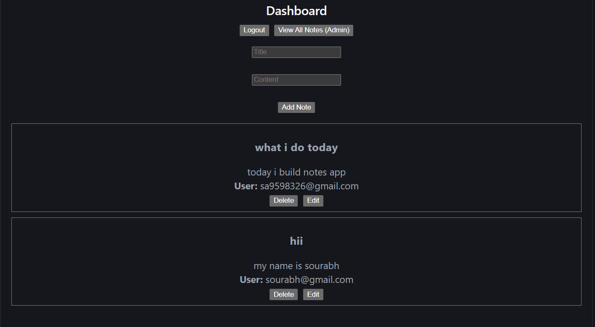

# 📝 Notes App

A secure and scalable full-stack Notes application with JWT authentication, role-based access control, and a clean React frontend. Built with **Node.js**, **Express**, **MongoDB**, and **React**.  
💡 Built as part of internship assignment showcasing secure backend architecture, real-world API design, and a complete React frontend.

---

## 🚀 Features

- 🔐 JWT Authentication (Login/Register)
- 👤 Role-Based Access (User & Admin)
- 📝 Notes CRUD Operations
- 🚫 Secure Logout using Token Blacklisting
- ⚡ Optimized queries using indexing
- 🛡️ Protected routes using middleware
- 🎨 Responsive React Frontend
- 🖥️ Admin Panel to manage all users' notes

---

## 🛠️ Tech Stack

**Backend**
- Node.js
- Express.js
- MongoDB (Mongoose)
- JWT
- bcrypt
- Cookie-parser

**Frontend**
- React.js
- Axios
- React Router DOM

---

## 📁 Project Structure

```
notes-app/
├── backend/
│   ├── src/
│   │   ├── controllers/
│   │   ├── middleware/
│   │   ├── models/
│   │   ├── routes/
│   │   └── app.js
│   ├── server.js
│   └── package.json
├── frontend/
│   ├── src/
│   │   ├── components/
│   │   ├── pages/
│   │   ├── services/
│   │   └── App.jsx
│   └── package.json
```

---

## ⚙️ Setup Instructions

**1. Clone the repository**
```bash
git clone https://github.com/shiviislive/notes-app.git
cd notes-app
```

**2. Install backend dependencies**
```bash
cd backend
npm install
```

**3. Create `.env` file in `/backend`**
```env
PORT=3000
MONGO_URI=your_mongodb_url
JWT_SECRET=your_secret
```

**4. Install frontend dependencies**
```bash
cd ../frontend
npm install
```

**5. Run the app**
```bash
# Terminal 1 — Backend
cd backend && npm run dev

# Terminal 2 — Frontend
cd frontend && npm start
```

---

## 🔑 API Endpoints

### Auth

| Method | Endpoint              | Description        | Access |
|--------|-----------------------|--------------------|--------|
| POST   | `/api/auth/register`  | Register new user  | Public |
| POST   | `/api/auth/login`     | Login & get token  | Public |
| POST   | `/api/auth/logout`    | Logout (blacklist) | Auth   |

### Notes

| Method | Endpoint          | Description       | Access       |
|--------|-------------------|-------------------|--------------|
| POST   | `/api/notes`      | Create a note     | User + Admin |
| GET    | `/api/notes`      | Get own notes     | User + Admin |
| PUT    | `/api/notes/:id`  | Update a note     | User + Admin |
| DELETE | `/api/notes/:id`  | Delete a note     | User + Admin |

### Admin

| Method | Endpoint         | Description   | Access     |
|--------|------------------|---------------|------------|
| GET    | `/api/notes/all` | Get all notes | Admin only |

---

## 📬 API Collection

Download Postman Collection:  
[notes-api.postman_collection.json](./notes-api.postman_collection.json)

---

## 🔐 Authentication & Authorization

- JWT-based authentication
- Token stored in cookies or headers
- Role-based access control:
  - **User** → manages own notes
  - **Admin** → can view all notes

---

## 🖥️ Frontend Screenshots

### 🔐 Login Page


### 📝 Register Page


### 👤 User Panel


### 🛡️ Admin Panel


---

## 📸 API Testing

### Register


### Login


### Logout


### Create Note


### Update Note


### Get Notes


### Admin Fetching all Notes


---

## 🧠 Key Learnings

- Implemented secure authentication using JWT
- Learned role-based authorization
- Debugged middleware and async issues
- Designed RESTful APIs with proper structure
- Built a full-stack app connecting React with Node.js

---

## 🚀 Future Improvements

- AI-based note summarization
- Pagination & search
- Note tagging / categories
- Deployment (Vercel + Railway)

---

## 👨‍💻 Author

**Shivam Agrawal**  
IIIT Bhopal